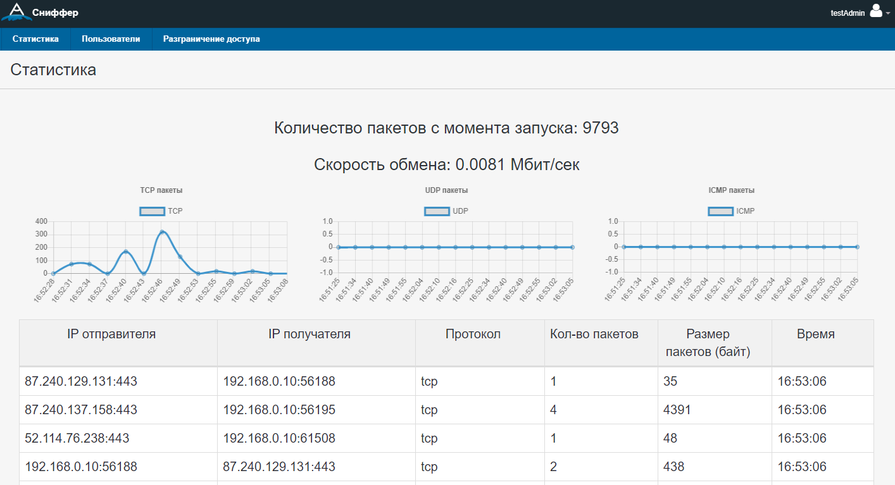
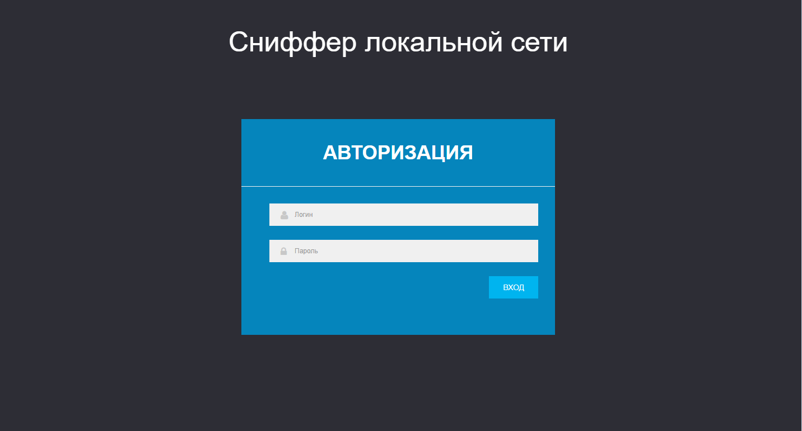
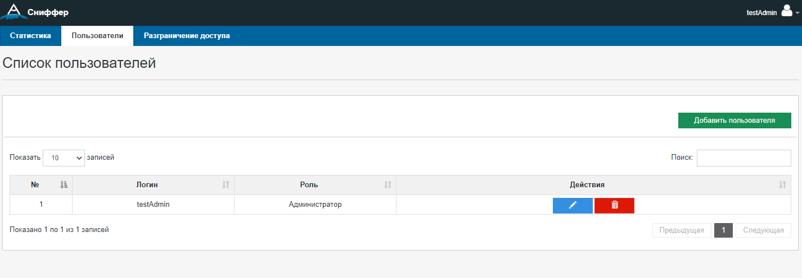

# Network-Sniffer
Данный веб интерфейс позволяет отслеживать сетевой трафик в локальной сети. 
В данном приложении реализован следующий функционал: 
<ul>
  <li>Сбор и вывод snapshot сетевого трафика(tcp, udp, icmp пакетов)</li>
  <li>Статистика в виде графиков</li>
  <li>Авторизация</li>
  <li>Добавление новых пользователей</li>
  <li>Матрица разграничения прав доступа</li>
  <li>Настройки сниффера</li>
</ul>
В работе использовался (NodeJS, Express, MongoDB, socket.io, session,activedirectory, handlebars)

